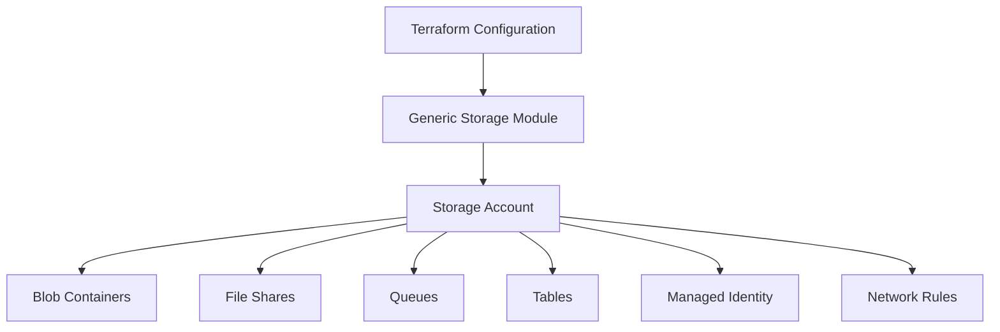

# 📦 Azure Storage Account Generic Module

<p align="center">
  
</p>

<p align="center">
  
  
  
  
</p>

---

## 📌 Overview

A reusable Terraform module for provisioning **Azure Storage Accounts** and their associated resources using a single configuration.

This module supports:

* Blob Containers
* File Shares
* Storage Queues
* Storage Tables
* Managed Identity
* Network Rules
* Enterprise Security Controls

Built using modern Terraform features such as `for_each`, `optional()`, `dynamic blocks`, and object-based configurations.

---

## 🏗️ Architecture



---

## ✨ Key Features

| Feature                 | Description                                         |
| ----------------------- | --------------------------------------------------- |
| 📦 Generic Module       | Manage multiple storage accounts using a single map |
| 🔄 Reusable Design      | Eliminates repetitive Terraform code                |
| ☁️ Azure Native         | Built specifically for Azure Storage services       |
| 🔐 Security First       | Supports TLS, Managed Identity & Firewalls          |
| ⚡ Dynamic Configuration | Uses dynamic blocks and optional attributes         |
| 🚀 Enterprise Ready     | Suitable for production deployments                 |

---

## 📊 Module Capabilities

<p align="center">


</p>

---

## 📂 Project Structure

```text
Storage_Account/
│
├── provider.tf
├── resource.tf
├── storage.tf
├── variables.tf
├── terraform.tfvars
└── README.md
```

---

## 🚀 Usage

### Module Configuration

```hcl
module "storage_accounts" {
  source = "./Storage_Account"

  strg = var.strg
}
```

---

### Example Configuration

```hcl
strg = {

  my_storage = {

    name                     = "stgenericdemo001"

    resource_group_name      = "storage-rg"

    location                 = "West Europe"

    account_tier             = "Standard"

    account_replication_type = "LRS"

    containers = {
      data = {
        name        = "app-data"
        access_type = "private"
      }
    }
  }
}
```

---

## 🛠️ Supported Resources

| Resource         | Supported |
| ---------------- | --------- |
| Storage Account  | ✅         |
| Blob Containers  | ✅         |
| File Shares      | ✅         |
| Queues           | ✅         |
| Tables           | ✅         |
| Managed Identity | ✅         |
| Network Rules    | ✅         |
| Private Access   | ✅         |

---

## ⚙️ Deployment

### Initialize Terraform

```bash
terraform init
```

### Validate Configuration

```bash
terraform validate
```

### Preview Changes

```bash
terraform plan -out=tfplan
```

### Apply Infrastructure

```bash
terraform apply tfplan
```

---

## 📤 Outputs

```hcl
output "storage_account_name" {
  value = azurerm_storage_account.storage.name
}
```

Example:

```text
storage_account_name = "stgenericdemo001"
```

---

## 🔐 Security Features

* TLS 1.2 Enforcement
* Managed Identity Support
* Network Access Restrictions
* Azure Firewall Compatibility
* Secure Storage Defaults

---

## 📈 Why Use This Module?

* Reduces Terraform code duplication
* Supports enterprise-scale deployments
* Simplifies storage resource management
* Uses modern Terraform design patterns
* Easy to extend and maintain

---

## 🎯 Learning Outcomes

* Terraform Module Design
* Azure Storage Services
* Dynamic Blocks
* Object-Based Variables
* Infrastructure as Code
* Enterprise Terraform Patterns

---

## 👩‍💻 Author

**Priya Jaiswal**

Azure Cloud | DevOps | Terraform

<p align="center">
  <a href="https://github.com/Pjaisw1103">
    
  </a>

  <a href="https://linkedin.com/in/priya-jaiswal1103">
    
  </a>
</p>

---

<p align="center">
⭐ If this module helped you, consider giving it a star.
</p>
