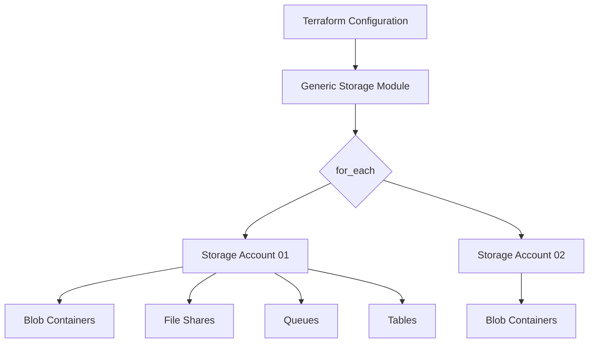

# 📦 Azure Storage Account – Terraform Generic Module 🚀

<p align="center">
  
  
  
</p>

## 🌟 Overview
This is a **High-Level Generic Terraform Module** designed to provision Azure Storage Accounts and all their associated sub-resources (Containers, File Shares, Queues, and Tables) using a single, unified configuration.

It leverages advanced Terraform features like `optional()`, `dynamic blocks`, and `for_each` to provide maximum flexibility with minimum code repetition.

---

## 🏗️ Architecture Diagram


---

## ✨ Key Features
- ✅ **Truly Generic** — Manage multiple storage accounts and their sub-resources in one `map`.
- 🔐 **Security First** — Supports Managed Identity, TLS 1.2+, and Network Firewalls by default.
- 📦 **Sub-resource Support** — Automatically flattens and creates Containers, Shares, Queues, and Tables.
- 🛠️ **Dynamic Configuration** — Uses dynamic blocks for Network Rules, Identity, and Blob Properties.
- 🧹 **Clean Variable Schema** — 90% of arguments are `optional()`, making your `tfvars` lean.

---

## 📁 Project Structure
```text
Storage_Account/
├── provider.tf        # ☁️ Azure Provider & Versioning
├── resource.tf        # 🏗️ Resource Group (Shared)
├── storage.tf         # ⚙️ Core Logic (Storage + Sub-resources)
├── variables.tf       # 📝 Input Definitions with optionality
├── terraform.tfvars   # 🛠️ User Configuration (Example)
└── README.md          # 📖 Documentation (You are here)
```

---

## 🚀 How to Run

### 1️⃣ Prerequisites
- Azure CLI installed and authenticated (`az login`).
- Terraform v1.5+ installed.

### 2️⃣ Step-by-Step Execution
```bash
# Initialize the workspace and download providers
terraform init

# Validate the syntax and configuration
terraform validate

# Preview the changes
terraform plan -out=tfplan

# Apply the configuration
terraform apply "tfplan"
```

---

## 📊 Variable Stats & Types

| Argument | Type | Required | Default | Description |
| :--- | :--- | :---: | :---: | :--- |
| `name` | `string` | Yes | - | Unique name of the storage account |
| `resource_group_name` | `string` | Yes | - | Name of the RG |
| `location` | `string` | Yes | - | Azure Region |
| `account_tier` | `string` | Yes | - | Standard or Premium |
| `account_replication_type`| `string` | Yes | - | LRS, GRS, ZRS, etc. |
| `containers` | `map(object)` | No | `{}` | List of blob containers to create |
| `shares` | `map(object)` | No | `{}` | List of file shares to create |
| `identity` | `object` | No | `null` | System/User Assigned Identity |

---

## 💡 Example Usage (`terraform.tfvars`)
```hcl
strg = {
  "my_storage" = {
    name                     = "stgenericdemo001"
    resource_group_name      = "storage_rg"
    location                 = "West Europe"
    account_tier             = "Standard"
    account_replication_type = "LRS"
    
    containers = {
      "data" = { name = "app-data", access_type = "private" }
    }
  }
}
```

---

## 🎯 Final Notes
This module is built to be **Enterprise-Ready**. It follows Azure Best Practices for security and naming conventions.

**Author:** Priya Jaiswal 
**Role:** Terraform & DevOps Architect 🛡️
