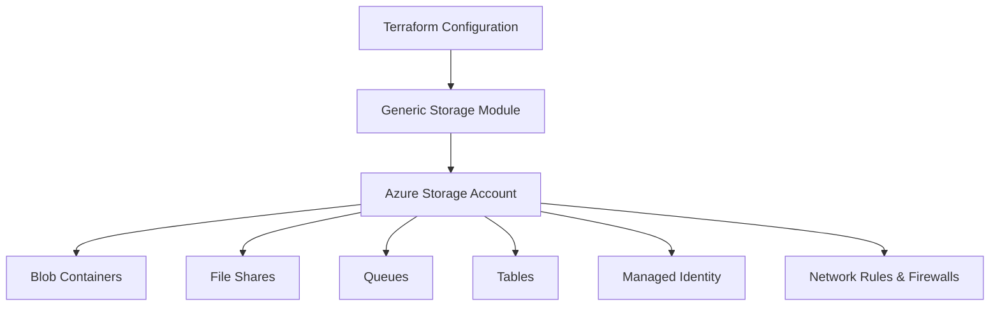

# Azure Storage Account Generic Terraform Module

A clean, production-ready, and reusable Terraform module designed to provision and manage multiple Azure Storage Accounts along with associated sub-resources using a single map configuration.

---

## Features

- **Generic & Modular**: Deploy multiple storage accounts in a single execution using object maps.
- **Sub-Resource Support**: Provisions Blob Containers, File Shares, Storage Queues, and Storage Tables dynamically.
- **Enterprise Security**: Built-in support for TLS 1.2+, Managed Identities (System/User Assigned), and Network Rules (IP rules & Virtual Network Subnets).
- **Data Protection**: Supports Blob Versioning, Change Feed, and Delete Retention Policies.
- **Clean HCL Structure**: Utilizes modern Terraform features including `for_each`, `optional()`, and `dynamic` blocks.

---

## Architecture


```mermaid
flowchart TD
    A[Terraform Configuration] --> B[Generic Storage Module]
    B --> C[Azure Storage Account]
    C --> D[Blob Containers]
    C --> E[File Shares]
    C --> F[Queues]
    C --> G[Tables]
    C --> H[Managed Identity]
    C --> I[Network Rules & Firewalls]
```

---

## Repository Structure

```text
Storage_Account/
├── provider.tf        # Terraform & Provider configuration (azurerm)
├── resource.tf        # Resource Group definition
├── storage.tf         # Storage Account & sub-resources logic
├── variables.tf       # Input variable declarations & object schema
├── terraform.tfvars   # Example input configuration values
└── README.md          # Module documentation
```

---

## Quick Start

### 1. Module Integration

```hcl
module "storage_accounts" {
  source = "./Storage_Account"

  strg = var.strg
}
```

### 2. Configuration Example (`terraform.tfvars`)

```hcl
strg = {
  "prod_storage" = {
    name                     = "stgenericprod001"
    resource_group_name      = "storage_rg"
    location                 = "West Europe"
    account_tier             = "Standard"
    account_replication_type = "GRS"
    account_kind             = "StorageV2"
    access_tier              = "Hot"

    # Security & Access Controls
    https_traffic_only_enabled      = true
    min_tls_version                 = "TLS1_2"
    public_network_access_enabled   = true
    shared_access_key_enabled       = true
    default_to_oauth_authentication = true

    # Network Security Rules
    network_rules = {
      default_action             = "Deny"
      ip_rules                   = ["103.1.1.1"]
      bypass                     = ["AzureServices", "Logging", "Metrics"]
      virtual_network_subnet_ids = []
    }

    # Managed Identity
    identity = {
      type = "SystemAssigned"
    }

    # Blob Service Retention
    blob_properties = {
      versioning_enabled  = true
      change_feed_enabled = true
      delete_retention_policy = {
        days = 14
      }
    }

    # Containers
    containers = {
      "logs" = {
        name                  = "app-logs"
        container_access_type = "private"
      }
    }

    # File Shares
    shares = {
      "files" = {
        name  = "shared-files"
        quota = 50
      }
    }

    tags = {
      Environment = "Production"
      ManagedBy   = "Terraform"
    }
  }
}
```

---

## Deployment Steps

```bash
# Initialize Terraform working directory
terraform init

# Validate configuration syntax
terraform validate

# Review execution plan
terraform plan

# Apply infrastructure changes
terraform apply
```

---

## Module Inputs & Outputs

### Key Input (`var.strg`)

| Parameter | Type | Required | Description |
| :--- | :--- | :--- | :--- |
| `name` | `string` | Yes | Unique name of the storage account |
| `resource_group_name` | `string` | Yes | Target Azure Resource Group name |
| `location` | `string` | Yes | Azure region (e.g., `West Europe`) |
| `account_tier` | `string` | Yes | Storage tier (`Standard` / `Premium`) |
| `account_replication_type` | `string` | Yes | Replication type (`LRS`, `GRS`, `ZRS`, etc.) |
| `network_rules` | `object` | No | Firewall rules and network restrictions |
| `identity` | `object` | No | System-assigned or User-assigned identities |
| `containers` | `map(object)` | No | Map of Blob Container configurations |
| `shares` | `map(object)` | No | Map of File Share configurations |

### Key Outputs

| Output Name | Description |
| :--- | :--- |
| `storage_account_name` | Primary deployed storage account name |

---

## Author

**Priya Jaiswal**  
[GitHub](https://github.com/Pjaisw1103) • [LinkedIn](https://linkedin.com/in/priya-jaiswal1103)
